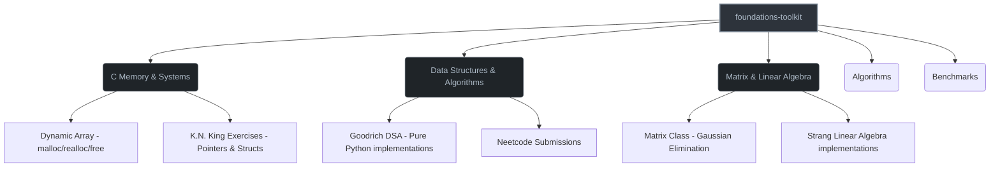

# Foundations Toolkit

> A rigorous, ground-up implementation of the mathematical, algorithmic, and systems foundations required for Machine Learning Systems Engineering.

## Purpose

This repository is not a collection of homework assignments. It is a proof-of-work artifact. Every directory contains implementations built from scratch to satisfy the four-level **Mastery Standard**:

1. **Explain:** Articulate the concept without notes.
2. **Derive:** Derive the underlying mathematics by hand.
3. **Implement:** Rebuild the concept from first principles (no magic libraries).
4. **Engineer:** Test, benchmark, profile, and document the system.

## Architecture



## Directory Structure

| Directory | Focus | Key Artifacts |
| :--- | :--- | :--- |
| `c_memory/` | Manual memory management, pointers, Stack vs. Heap. | Dynamic Array (Valgrind certified), K.N. King exercises. |
| `dsa/` | Data structures from scratch (Goodrich methodology). | Hash Maps, Trees, Dynamic Arrays in pure Python. |
| `matrix/` | Linear algebra, matrix operations, Gaussian elimination. | Pure Python Matrix class, NumPy memory stride comparisons. |
| `algorithms/` | Algorithmic problem solving and complexity analysis. | Sorting, searching, and amortized time complexity proofs. |
| `benchmarks/` | Empirical performance proofs. | Time complexity benchmarks (C vs. Python). |
| `tests/` | Unit and integration testing. | Test suites for core data structures. |

## Build & Reproducibility

Each sub-directory contains its own build instructions. For the C components, ensure you have `gcc` and `valgrind` installed on a Linux environment (tested on Fedora KDE).

```bash
# Example: Compiling and profiling the Dynamic Array
cd c_memory
gcc -g -Wall -Wextra -Werror main.c -o dynarray
valgrind --leak-check=full --show-leak-kinds=all ./dynarray
```

## 👤 Author

**Rayan Akioud**  
Engineering Student, ENSAM Casablanca (IAGI)  
*Target: ML Systems Engineer / AI Infrastructure Engineer*
