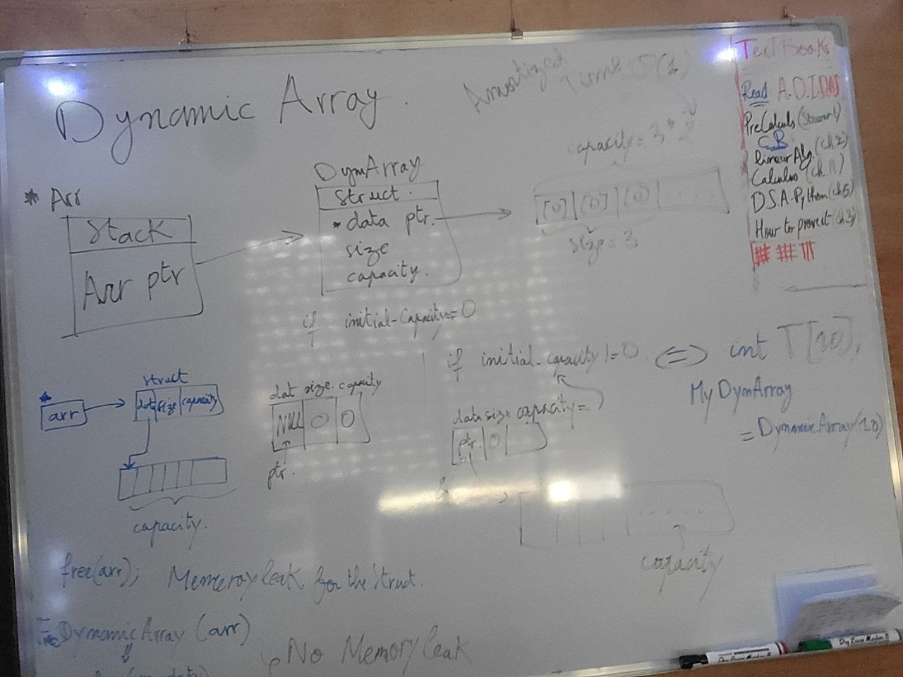

# C Dynamic Array (Manual Memory Management)

> A ground-up implementation of a dynamic array in C, designed to enforce mastery of manual heap allocation, pointer arithmetic, and memory safety.

## The Memory Model

A robust dynamic array requires two distinct levels of heap allocation to separate metadata from the payload:

1. **The Envelope (Struct):** Allocated on the heap, holding the metadata (`data` pointer, `size`, `capacity`).
2. **The Contents (Data Array):** A contiguous block of integers pointed to by `arr->data`.

```text
Stack:                Heap:
+-----------+        +----------------------+        +-------------------+
| arr ptr   | ---->  | DynamicArray struct  | ---->  | int data array    |
+-----------+        | - data ptr           |        | [0][0][0][0]...   |
                     | - size = 0           |        +-------------------+
                     | - capacity = cap     |
                     +----------------------+
```



## Mathematical Grounding

The core engineering challenge is the `append` (push) operation. If we call `realloc` on every insertion, the time complexity is $O(N)$ per operation, resulting in $O(N^2)$ total time for $N$ insertions.

By implementing a geometric growth strategy (doubling capacity when full), we achieve **Amortized $O(1)$** time complexity. The total time $T(N)$ for $N$ insertions is bounded by:

$$
T(N) = \sum_{i=1}^{N} O(1) + \sum_{k=1}^{\log_2 N} O(2^k) = O(N)
$$

This proves that the average cost per insertion remains constant, even though individual insertions occasionally trigger a costly $O(N)$ memory copy.

## Implementation Details

- **Growth Strategy:** Capacity doubles (`capacity * 2`) strictly when `size == capacity`. An initial capacity of 0 safely initializes to 1.
- **Memory Safety:** `realloc` is only invoked when the array is full. The return value of `realloc` is assigned to a temporary pointer and checked for `NULL` before overwriting `arr->data`. This prevents memory leaks and dangling pointers if the OS denies the allocation.
- **Bounds Checking:** `get` and `set` operations explicitly verify the target index against `size` before dereferencing memory.
- **Cleanup:** `dynarray_free` explicitly frees the inner `data` array before freeing the outer struct, preventing orphaned heap blocks.

## Memory Validation (Valgrind)

Certified on the full 100,000-element benchmark run — zero leaks at scale:

```text
==9237== HEAP SUMMARY:
==9237==     in use at exit: 0 bytes in 0 blocks
==9237==   total heap usage: 100,019 allocs, 100,019 frees, 20,001,249,636 bytes allocated
==9237== 
==9237== All heap blocks were freed -- no leaks are possible
==9237== ERROR SUMMARY: 0 errors from 0 contexts
```

Note the total allocation volume: **20,001,249,636 bytes** of heap traffic to store a final payload of 400,000 bytes (100,000 `int`s). The naive strategy moved ~50,000x more memory than the data it holds — the $O(N^2)$ formula, printed as a byte count.

## Performance Benchmark

100,000 insertions per strategy. Hardware: AMD Ryzen 7 7700, 32 GB DDR5. Compiled with `gcc -O0 -g -Wall -Wextra`.

| Environment | Naive (+1 realloc per push) | Doubling (amortized) | Speedup |
| :--- | :--- | :--- | :--- |
| **Native (glibc)** | 0.000814 s | 0.000396 s | ~2.0x |
| **Valgrind Memcheck** | 9.154867 s | 0.005440 s | ~1,683x |

**Reading the numbers honestly.** Natively, glibc's `realloc` repeatedly extends the heap's top chunk in place, so the naive run avoids most copies and the gap looks small. Under Valgrind's allocator — and in any real, fragmented heap where in-place extension is impossible — every `+1` realloc performs a full array copy, and the algorithmic gap appears in full: **1,683x**, with **20 GB** of allocation traffic for a **400 KB** payload.

Complexity is a property of the algorithm; constant factors are a property of the allocator. An engineer measures both.

## Build & Execution

```bash
# Compile with strict warnings and debug symbols
gcc -g -O0 -Wall -Wextra DynamicArray-MVP.c -o dynarric

# Native timing run (benchmark)
./dynarric

# Memory audit run (validation — never benchmark under Valgrind)
valgrind --leak-check=full --show-leak-kinds=all ./dynarric
```

*Built as part of the `foundations-toolkit` Master Plan.*
